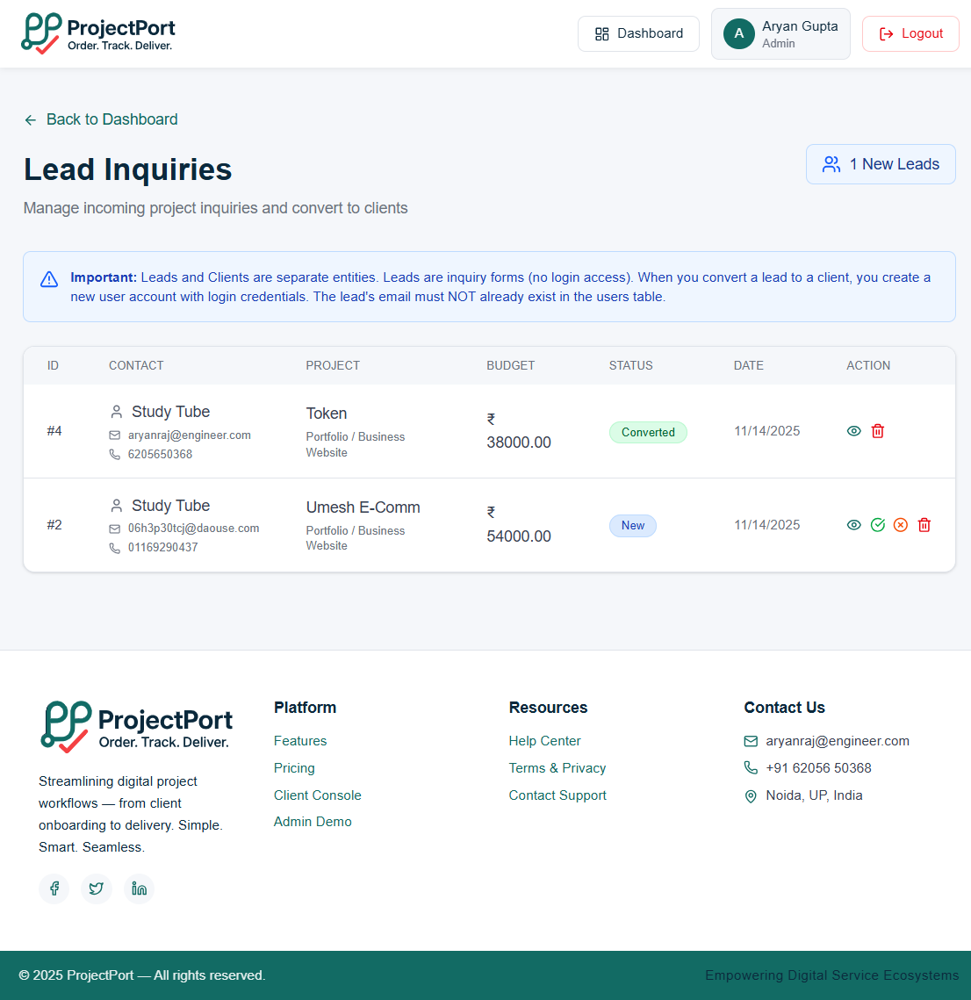
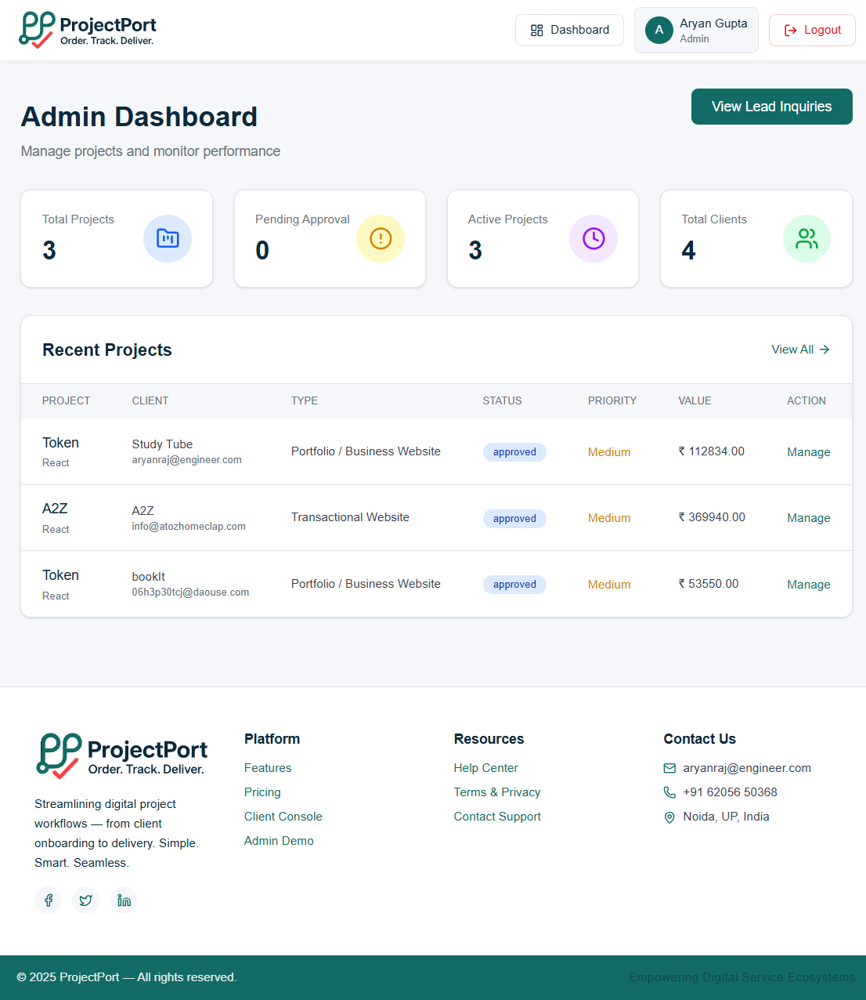
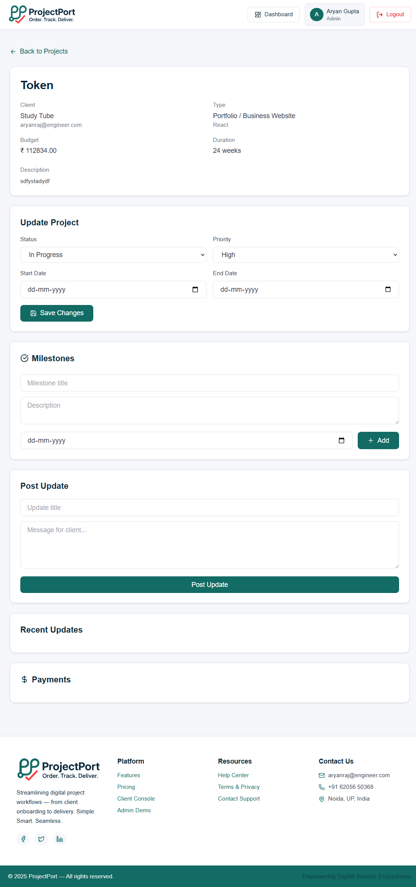
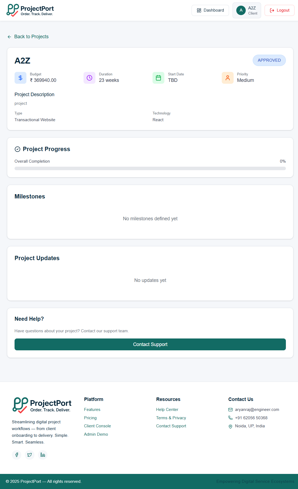

<p align="center">
  
</p>

<h1 align="center">🚀 ProjectPort</h1>
<h3 align="center">Order. Track. Deliver.</h3>

<p align="center">
  <b>A comprehensive full-stack platform for managing client projects, automated quotations, and seamless project delivery</b>
</p>

<p align="center">
  <a href="#-features">Features</a> •
  <a href="#-tech-stack">Tech Stack</a> •
  <a href="#-installation">Installation</a> •
  <a href="#-documentation">Documentation</a> •
  <a href="#-demo">Demo</a>
</p>

<p align="center">
  
  
  
  
</p>

---

## 📖 Table of Contents

- [Overview](#-overview)
- [Features](#-features)
- [Tech Stack](#-tech-stack)
- [Architecture](#-architecture)
- [Installation](#-installation)
- [Configuration](#-configuration)
- [Usage](#-usage)
- [API Documentation](#-api-documentation)
- [Screenshots](#-screenshots)
- [Project Structure](#-project-structure)
- [Contributing](#-contributing)
- [License](#-license)

---

## 🎯 Overview

**ProjectPort** is an intelligent project management and client interaction platform designed to streamline the entire project lifecycle—from initial inquiry to final delivery. Built for development agencies, freelancers, and project-based businesses, it bridges the gap between clients and development teams with powerful automation and real-time collaboration features.

### 🎭 Key Roles

- **👥 Clients**: Submit project inquiries, receive instant quotations, track progress, manage payments
- **⚙️ Admins**: Manage leads, convert inquiries to projects, assign teams, oversee delivery
- **👨‍💻 Developers**: Access assigned tasks, update progress, collaborate with teams (coming soon)

---

## ✨ Features

### 🔥 Core Features

- **📋 Dynamic Project Wizard**

  - Multi-step intelligent form with dependent inputs
  - Real-time price calculation based on selections
  - Support for web, mobile, e-commerce, and custom projects

- **💰 Automated Quotation Engine**

  - Excel-driven pricing rules → JSON configuration
  - Instant cost estimation with detailed breakdowns
  - Customizable pricing models

- **🔄 Complete Lead Management**

  - Capture inquiries with detailed requirements
  - Review and qualify leads
  - One-click conversion to active projects
  - Automated client account creation

- **📊 Comprehensive Dashboards**

  - **Client Dashboard**: Project overview, real-time status, payment tracking
  - **Admin Dashboard**: Business analytics, lead pipeline, project monitoring
  - Real-time notifications and updates

- **🎯 Project Management**

  - Milestone tracking with progress indicators
  - Payment schedules and invoice management
  - Document sharing and collaboration
  - Status updates and activity logs

- **🔔 Smart Notifications**

  - Real-time in-app notifications
  - Email alerts for critical events
  - Customizable notification preferences

- **🔒 Security & Authentication**
  - JWT-based authentication
  - Role-based access control (RBAC)
  - Secure password hashing with bcrypt
  - Protected API endpoints

### 🚀 Advanced Features

- **SEO Optimized**: Complete on-page and technical SEO implementation
- **PWA Ready**: Progressive Web App with offline capabilities
- **Responsive Design**: Mobile-first, works on all devices
- **Performance Optimized**: Lazy loading, code splitting, caching strategies

---

## 🛠️ Tech Stack

### Frontend

- **Framework**: React 18.2.0 with Vite
- **Styling**: Tailwind CSS 3.x
- **Routing**: React Router v6
- **State Management**: React Hooks & Context API
- **HTTP Client**: Fetch API
- **SEO**: React Helmet Async
- **Icons**: Lucide React
- **Form Handling**: Custom validation

### Backend

- **Runtime**: Node.js 20.x
- **Framework**: Express.js 4.x
- **Database**: MySQL 8.0
- **Authentication**: JWT (jsonwebtoken)
- **Password Hashing**: bcrypt.js
- **Environment**: dotenv
- **Security**: CORS, Helmet (recommended)

### DevOps & Tools

- **Version Control**: Git & GitHub
- **Package Manager**: npm
- **Code Quality**: ESLint, Prettier
- **Deployment**: Vercel (Frontend), Railway/Render (Backend)
- **Database Hosting**: PlanetScale, AWS RDS, or local MySQL

---

## 🏗️ Architecture

```
ProjectPort/
│
├── client/                 # Frontend React application
│   ├── src/
│   │   ├── components/    # Reusable UI components
│   │   ├── pages/         # Page components
│   │   ├── layout/        # Layout components (Header, Footer)
│   │   ├── utils/         # Utility functions & configs
│   │   └── assets/        # Static assets
│   └── public/            # Public files (manifest, icons, sitemaps)
│
├── server/                # Backend Node.js application
│   ├── index.js          # Main server file with all routes
│   ├── db.js             # Database connection
│   ├── utils/            # Utility functions
│   └── .env              # Environment variables
│
└── database/             # Database schemas and migrations
    └── schema.sql        # Complete database structure
```

### Data Flow

```
Client Request → React Router → Page Component → API Call →
Express Route → Auth Middleware → Database Query →
Response → State Update → UI Render
```

---

## 📦 Installation

### Prerequisites

- **Node.js**: v18.x or higher
- **MySQL**: v8.0 or higher
- **npm**: v9.x or higher
- **Git**: Latest version

### Step 1: Clone the Repository

```bash
git clone https://github.com/aryanony/ProjectPort.git
cd ProjectPort
```

### Step 2: Database Setup

1. **Create MySQL Database**:

```bash
mysql -u root -p
```

2. **Run the Schema**:

```sql
CREATE DATABASE projectport CHARACTER SET utf8mb4 COLLATE utf8mb4_unicode_ci;
USE projectport;
source database_schema.sql;
```

3. **Verify Installation**:

```sql
SHOW TABLES;
SELECT * FROM users;
```

### Step 3: Backend Setup

```bash
cd server
npm install
```

Create `.env` file:

```env
PORT=4000
CLIENT_ORIGIN=http://localhost:5173
JWT_SECRET=your-super-secret-jwt-key-change-in-production
DB_HOST=localhost
DB_USER=root
DB_PASSWORD=your_mysql_password
DB_NAME=projectport
DB_PORT=3306
```

Start the server:

```bash
npm run dev
# or
node index.js
```

Server runs at: `http://localhost:4000`

### Step 4: Frontend Setup

```bash
cd client
npm install
```

Create `.env` (optional):

```env
VITE_API_URL=http://localhost:4000
```

Start the development server:

```bash
npm run dev
```

Application runs at: `http://localhost:5173`

### Step 5: Generate SEO Files

```bash
cd server
node utils/generateSitemap.js
```

This generates:

- `client/public/sitemap.xml`
- `client/public/sitemap.html`

---

## ⚙️ Configuration

### Environment Variables

#### Backend (`.env` in `/server`)

```env
# Server Configuration
PORT=4000
CLIENT_ORIGIN=http://localhost:5173

# Security
JWT_SECRET=your-jwt-secret-minimum-32-characters
NODE_ENV=development

# Database
DB_HOST=localhost
DB_USER=root
DB_PASSWORD=your_password
DB_NAME=projectport
DB_PORT=3306

# Optional: Email Service (for notifications)
SMTP_HOST=smtp.gmail.com
SMTP_PORT=587
SMTP_USER=your-email@gmail.com
SMTP_PASS=your-app-password
```

#### Frontend (`.env` in `/client`)

```env
VITE_API_URL=http://localhost:4000
VITE_SITE_URL=http://localhost:5173
```

### Default Credentials

After running the database schema:

**Admin Account**:

- Email: `admin@projectport.com`
- Password: `admin123`

**Demo Client Account**:

- Email: `client@gmail.com`
- Password: `client123`

⚠️ **Important**: Change these credentials in production!

---

## 🎮 Usage

### For Clients

1. **Start a Project**:

   - Visit `/start-project`
   - Choose project type (Web, Mobile, E-commerce, Custom)
   - Fill in requirements through the wizard
   - Get instant quotation
   - Submit inquiry

2. **Track Projects**:
   - Register/Login to your account
   - View all projects on dashboard
   - Track milestones and progress
   - Manage payments
   - Communicate with the team

### For Admins

1. **Manage Leads**:

   - View new inquiries at `/admin/leads`
   - Review project details and quotations
   - Convert leads to active projects
   - Assign to development team

2. **Manage Projects**:
   - Monitor all projects at `/admin/projects`
   - Update project status
   - Add milestones and payments
   - Send updates to clients
   - Track team assignments

---

## 📚 API Documentation

### Authentication Endpoints

#### Register

```http
POST /api/auth/register
Content-Type: application/json

{
  "email": "user@example.com",
  "password": "securepassword",
  "full_name": "John Doe",
  "phone": "1234567890",
  "company": "Tech Corp"
}
```

#### Login

```http
POST /api/auth/login
Content-Type: application/json

{
  "email": "user@example.com",
  "password": "securepassword"
}
```

#### Get Current User

```http
GET /api/auth/me
Authorization: Bearer {token}
```

### Lead Endpoints

#### Create Lead

```http
POST /api/leads
Content-Type: application/json

{
  "projectName": "E-commerce Website",
  "name": "John Doe",
  "email": "john@example.com",
  "phone": "1234567890",
  "company": "ABC Corp",
  "typeKey": "ecommerce",
  "typeLabel": "E-commerce Website",
  "description": "Need an online store",
  "budget": 50000,
  ...
}
```

#### Get All Leads (Admin)

```http
GET /api/leads
Authorization: Bearer {admin_token}
```

#### Convert Lead to Client (Admin)

```http
POST /api/leads/:id/convert
Authorization: Bearer {admin_token}
Content-Type: application/json

{
  "password": "clientpassword"
}
```

### Project Endpoints

#### Get All Projects

```http
GET /api/projects
Authorization: Bearer {token}
```

#### Get Project Details

```http
GET /api/projects/:id
Authorization: Bearer {token}
```

#### Update Project (Admin)

```http
PATCH /api/projects/:id
Authorization: Bearer {admin_token}
Content-Type: application/json

{
  "status": "in_progress",
  "priority": "high"
}
```

### Milestone Endpoints

#### Create Milestone (Admin)

```http
POST /api/projects/:id/milestones
Authorization: Bearer {admin_token}
Content-Type: application/json

{
  "title": "Design Phase Complete",
  "description": "All mockups approved",
  "due_date": "2025-12-31"
}
```

### Payment Endpoints

#### Add Payment (Admin)

```http
POST /api/projects/:id/payments
Authorization: Bearer {admin_token}
Content-Type: application/json

{
  "amount": 20000,
  "payment_type": "advance",
  "due_date": "2025-12-15",
  "status": "pending"
}
```

### Notification Endpoints

#### Get Notifications

```http
GET /api/notifications
Authorization: Bearer {token}
```

#### Mark as Read

```http
PATCH /api/notifications/:id/read
Authorization: Bearer {token}
```

---

## 📸 Screenshots

<details>
<summary>Click to expand screenshots</summary>

### Landing Page


### Project Wizard


### Lead Submission



### Admin Dashboard



### Project Management



### Client Dashboard


### Project Tracking



</details>

---

## 📁 Project Structure

```
ProjectPort/
│
├── client/                           # Frontend Application
│   ├── public/
│   │   ├── manifest.json            # PWA manifest
│   │   ├── robots.txt               # SEO robots file
│   │   ├── sitemap.xml              # XML sitemap
│   │   ├── sitemap.html             # HTML sitemap
│   │   └── icons/                   # PWA icons
│   │
│   ├── src/
│   │   ├── components/
│   │   │   ├── SEO.jsx              # SEO component
│   │   │   ├── ProjectForm.jsx      # Multi-step form
│   │   │   ├── ProjectTypeCard.jsx  # Project type selector
│   │   │   ├── SidebarPricing.jsx   # Real-time pricing
│   │   │   └── RecentSubmissions.jsx
│   │   │
│   │   ├── pages/
│   │   │   ├── Landing.jsx          # Home page
│   │   │   ├── Login.jsx            # Authentication
│   │   │   ├── Register.jsx
│   │   │   ├── ClientConsole.jsx    # Project wizard
│   │   │   ├── ClientDashboard.jsx  # Client overview
│   │   │   ├── ClientProjects.jsx   # Project list
│   │   │   ├── ClientProjectDetail.jsx
│   │   │   ├── AdminDashboard.jsx   # Admin overview
│   │   │   ├── AdminLeads.jsx       # Lead management
│   │   │   ├── AdminProjects.jsx    # Project management
│   │   │   └── AdminProjectDetail.jsx
│   │   │
│   │   ├── layout/
│   │   │   ├── Header.jsx           # Navigation
│   │   │   └── Footer.jsx
│   │   │
│   │   ├── utils/
│   │   │   ├── seo.config.js        # SEO configuration
│   │   │   └── api.js               # API helpers
│   │   │
│   │   ├── App.jsx                   # Main app component
│   │   ├── main.jsx                  # Entry point
│   │   └── global.css                # Global styles
│   │
│   ├── package.json
│   └── vite.config.js
│
├── server/                           # Backend Application
│   ├── utils/
│   │   └── generateSitemap.js       # Sitemap generator
│   │
│   ├── index.js                      # Main server & routes
│   ├── db.js                         # Database connection
│   ├── .env                          # Environment config
│   └── package.json
│
├── database/
│   └── schema.sql                    # Database structure
│
├── README.md                         # This file
├── CLIENT_README.md                  # Frontend documentation
├── SERVER_README.md                  # Backend documentation
└── .gitignore
```

---

## 🔒 Security

- **Authentication**: JWT-based with httpOnly cookies option
- **Password Security**: bcrypt hashing with salt rounds
- **SQL Injection**: Parameterized queries with mysql2
- **XSS Protection**: Input sanitization and validation
- **CORS**: Configured for specific origins
- **Rate Limiting**: Recommended for production
- **Environment Variables**: Sensitive data stored securely

### Security Best Practices

1. **Change default passwords** immediately
2. **Use strong JWT secrets** (minimum 32 characters)
3. **Enable HTTPS** in production
4. **Implement rate limiting** on API endpoints
5. **Regular security audits** with `npm audit`
6. **Keep dependencies updated**
7. **Use environment-specific configs**

---

## 🚀 Deployment

### Frontend (Vercel)

1. Push code to GitHub
2. Connect repository to Vercel
3. Configure environment variables
4. Deploy automatically on push

### Backend (Railway/Render)

1. Push code to GitHub
2. Connect to Railway/Render
3. Add environment variables
4. Configure MySQL database
5. Deploy

### Database (PlanetScale/AWS RDS)

1. Create database instance
2. Run schema migrations
3. Update backend .env with connection details
4. Enable SSL connections

---

## 🤝 Contributing

Contributions are welcome! Please follow these steps:

1. Fork the repository
2. Create a feature branch (`git checkout -b feature/AmazingFeature`)
3. Commit your changes (`git commit -m 'Add some AmazingFeature'`)
4. Push to the branch (`git push origin feature/AmazingFeature`)
5. Open a Pull Request

### Development Guidelines

- Follow existing code style
- Write clear commit messages
- Add comments for complex logic
- Test thoroughly before submitting
- Update documentation as needed

---

## 🐛 Known Issues & Roadmap

### Current Limitations

- No email notifications (SMTP integration planned)
- File uploads not yet implemented
- Payment gateway integration pending
- Mobile app version in planning

### Roadmap

- [ ] Email notification system
- [ ] File upload and document management
- [ ] Payment gateway integration (Razorpay/Stripe)
- [ ] Advanced analytics dashboard
- [ ] Team collaboration features
- [ ] Mobile application (React Native)
- [ ] Multi-language support
- [ ] Dark mode
- [ ] Export reports (PDF/Excel)

---

## 📄 License

This project is licensed under the MIT License - see the [LICENSE](LICENSE) file for details.

---

## 👨‍💻 Author

**Aryan Gupta**

- GitHub: [@aryanony](https://github.com/aryanony)
- Email: admin@projectport.com
- Phone: +91-6205650368

---

## 🙏 Acknowledgments

- React community for excellent documentation
- Tailwind CSS for the utility-first CSS framework
- Express.js for the robust backend framework
- MySQL for reliable database management
- All open-source contributors

---

## 📞 Support

Need help? Reach out:

- 📧 Email: admin@projectport.com
- 📱 Phone: +91-6205650368
- 🐛 Issues: [GitHub Issues](https://github.com/aryanony/ProjectPort/issues)
- 💬 Discussions: [GitHub Discussions](https://github.com/aryanony/ProjectPort/discussions)

---

<p align="center">
  Made with ❤️ by <a href="https://github.com/aryanony">Aryan Gupta</a>
</p>

<p align="center">
  <sub>⭐ Star this repo if you find it helpful!</sub>
</p>
