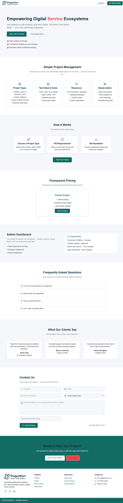
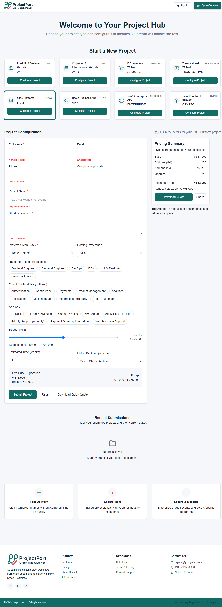

<<<<<<< HEAD
429: Too Many Requests
For more on scraping GitHub and how it may affect your rights, please review our Terms of Service (https://docs.github.com/en/site-policy/github-terms/github-terms-of-service).
=======
<p align="center">
  
</p>

<h1 align="center">🚀 ProjectPort — Order. Track. Deliver.</h1>

<p align="center">
  <b>A full-stack automation platform to handle clients, quotations, and project delivery with ease.</b><br/>
  <sub>Empowering smooth collaboration between Clients, Developers, and Admins.</sub>
</p>

---

### 🧩 Overview

**ProjectPort** is an intelligent project management and client-interaction system.  
It lets clients explore project types, auto-generate quotations, and place orders — while giving admins and developers a clear dashboard to track everything.

---

### 💡 Key Features

✅ **Dynamic Project Wizard** — Step-based form with dependent inputs and instant pricing.  
✅ **Automated Quotation** — Excel-based pricing rules → JSON engine → Instant cost estimate.  
✅ **Lead to Project Flow** — Inquiry → Review → Approval → Developer Assignment.  
✅ **Client Dashboard** — Track order status, view quotations, manage project documents.  
✅ **Admin Panel** — Manage clients, developers, approvals, payments, and project progress.  
✅ **Developer Console** — Assigned task list, file uploads, timeline tracking.  
✅ **Notifications** — Email/SMS updates on approvals or project updates.  
✅ **Fully Responsive UI** — Built with React + TailwindCSS.  
✅ **Secure API Layer** — Express.js + MySQL with validation and audit logs.  

---

### 🧰 Tech Stack

| Layer | Technology |
|-------|-------------|
| Frontend | React + Vite + Tailwind CSS |
| Backend | Node.js + Express.js |
| Database | MySQL |
| State Mgmt | React Hooks / Context |
| UI Forms | React Hook Form |
| Charts | Recharts |
| Deployment | Vercel / Render / Railway |
| Optional | Docker + GitHub Actions (CI/CD) |

---

### 📸 Screenshots

<p align="center">
  <br/>
  <br/>
</p>

---

### ⚙️ Installation & Setup

#### 🖥️ Frontend
```bash
cd client
npm install
npm run dev
>>>>>>> f9128a77e9fa1acfe960c5d0289b59bd66085485
